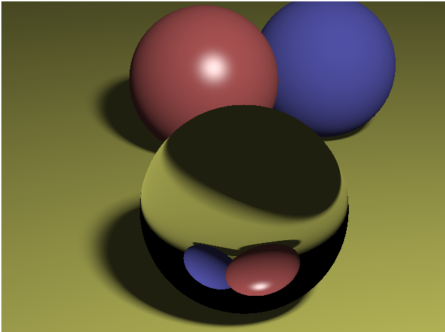

# Browser Ray Tracer

An educational ray tracer written in vanilla JavaScript. It renders directly to an HTML canvas and uses Three.js for vector, color, and geometry utilities.

This is a re-upload from my undergraduate era. I had a great time smacking my head against the wall until I finally figured out how to implement these algorithms.



## Features

- Pinhole camera
- Plane, sphere, and triangle intersections
- OBJ mesh loading with optional smooth normals
- Ambient, point, spot, and sampled area lights
- Hard and soft shadows
- Diffuse and Phong specular shading
- Recursive mirror reflection and glass refraction
- Exposure and gamma correction

## Run it

Serve the repository from its root with any static web server:

```sh
python -m http.server 8000
```

Then open:

```text
http://localhost:8000/scenes/7.ball_glass.html
```

You can also try the other scenes in the `scenes/` folder.

## Project layout

- `raytracer.js` — render loop, tracing, shading, reflection, and refraction
- `camera.js`, `light.js`, `material.js`, `shape.js` — renderer primitives
- `scenes/` — example scenes and embedded model data
- `tests/` — geometry regression tests

## Development

Run the tests with:

```sh
npm test
```

## Credits and licensing

The project includes Three.js; see [NOTICE](NOTICE) for attribution and license details.

Some comments and structure originated from course-provided starter material and remain for historical context. The MIT license applies only to my original contributions, not to bundled dependencies, course material, or model data.
